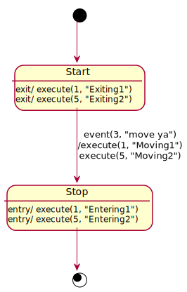

# A "json to statemachine" library

This library can take a json-encoded state machine and create a runnable state
machine from it. The supported state machine features and names are modeled
along the UML state chart diagram (which itself is based on finite automatas).

It allows not only to track a state but also to execute custom commands while
the states are traversed.

## Features

The describable state machines consist of

* a set of `states`
* one of them being the `initialState`
* a set of `finalStates` ("accepting states"); the state machine will report
    if one of them is reached; processing can nevertheless continue
* `transitions` defining when to change from state to state
* a set of `triggers`; they are matched against incoming events (the "input
    alphabet") and might trigger traversal of a transition
* a state can have one or more `onEntry` behaviors attached. These are
    commands (code given by the user of the library) that are executed when
    the state is entered via a transition.
* a state can also have one or more `onExit` behaviors attached which are
    executed when leaving the state
* a transition can have one or more `effects` behaviors attached which are
    executed when traversing the transition
* Given input is heavily checked and validated. Exceptions contain "useful"
  error messages (so the author of the json will know, what to fix)
* User provided code (the "behaviors") is wrapped at runtime. Thrown
  exceptions will be logged and don't affect the state machine or other
  behaviors.

## Example

The following state chart diagram has two states which are "connected" by
one transmission. If this transmission is traversed there are several
behaviors executed.

The way this lib allows a user to define commands is described as
"execute this command string on device with id 5". What exactly "device 5"
is and how it handles a given command string is completely up to the
user's code.



This state charts is shown as json in the following block.

Triggers are identified in the json via an `eventSourceId` and an
`eventPayload`.

Behaviors are described in a way so that the json part only
contains an identifier and the user of this lib has to provide the
implementation (identified by a `deviceId` and a `commandString`).

```json
{
  "initialState" : "Start",
  "triggers" : [
    {
      "name" : "move",
      "eventSourceId" : 3,
      "eventPayload" : "move ya"
    }
  ],
  "states" : [
    {
      "name" : "Start",
      "onExit" : [
        {
          "deviceId" : 1,
          "commandString" : "Exiting1"
        }, {
          "deviceId" : 5,
          "commandString" : "Exiting2"
        }
      ],
      "transitions" : [
        {
          "triggerName" : "move",
          "targetState" : "Stop",
          "effects" : [
            {
              "deviceId" : 1,
              "commandString" : "Moving1"
            },{
              "deviceId" : 5,
              "commandString" : "Moving2"
            } ]
        } ]
    },
    {
      "name" : "Stop",
      "onEntry" : [
        {
          "deviceId" : 1,
          "commandString" : "Entering1"
        }, {
          "deviceId" : 5,
          "commandString" : "Entering2"
        } ]
    } ],
  "finalStates" : [ "Stop" ]
}
```

## Maven

```xml
    <dependency>
        <groupId>com.github.aytchell</groupId>
        <artifactId>json-statemachine</artifactId>
        <version>2.0.0</version>
    </dependency>
```

## Basic usage

The API of this lib is quite slim.
Given a string with a json encoded state machine the caller first has to
start the parser:

```java
final String jsonStateMachine = "{ ... }";

final StateMachineCompiler compiler = StateMachineParser.parse(jsonStateMachine);
```

The parser will also validate the given json string. If something is wrong,
it will throw a `ValidationException` which will contain detailed information
what's wrong.

Parsing the json will give you a `StateMachineCompiler`. This compiler knows
which `eventSourceId`s send required events and it knows, the `deviceId`s
of the devices where `commandString`s will be executed.

```java
Set<Integer> eventSourceIds = compiler.getAcceptedEventSources();

Set<Integer> deviceIds = compiler.getRequiredDevices();
```

The `eventSourceIds` will be important during execution of the state machine.
The `deviceIds` are important to actually "compile" the state machine. For
each given `deviceId` the caller has to provide an implementation of

```java
public interface DeviceCommandCompiler {
    DeviceCommand compile(String commandString) throws Exception;
}
```

for a given `commandString` this `DeviceCommandCompiler` must be able to
create an implementation of

```java
public interface DeviceCommand {
    void execute();
}
```

How this is done is completely up to the specific `DeviceCommandCompiler`.
If `DeviceCommandCompilers` are available for all the requested `deviceIds`
it's possible to compile  the state machine:

```java
Map<Integer, DeviceCommandCompiler> commandCompilers = Map.of(...);

final StateMachine machine = compiler.compileStateMachine(commandCompilers);
```

During compilation a `CompilationException` might be thrown (e.g. if compiling
a command throw or if a command compiler is missing). This exception will
contain information to figure out, what's wrong.

If compilation succeeds you'll have a `StateMachine` where you basically only
have to inject events and the machine takes care of the rest. Only command
from the `eventSourceIds` returned by the parser will trigger an action.
All others will be ignored.

```java
boolean isFinal = machine.injectEvent(3, "move ya");
```

The return value will tell you whether you've reached a final state. (Of
course it's possible to leave a final state if you inject another event.)
Beneath informing the caller about the final state it does not have any
effects on the state machine.

## State-machine json

The top-level structure of the accepted json format is shown in the block below.
You can see four of the five elements of a finite automata. The `transitions` are
placed at their respective start state.

```json
{
  "initialState" : "...",
  "triggers" : [ ... ],
  "states" : [ ... ],
  "finalStates" : [ ... ]
}
```

### initialState

The `initialState` is mandatory. Its value is a string denoting the name of the state where
execution of the state machine starts. Note that the machine starts inside this state.
If there are `onEntry` behaviors they will not get executed on startup.

### triggers

The `triggers` entry is mandatory. Its value is an array of trigger descriptions
which must contain at least one entry. Each description of a trigger has this format:

```json
{
  "name" : "...",
  "eventSourceId" : int,
  "eventPayload" : "..."
}
```

A trigger describes an event coming from a device (identified via an ID)
and having a known payload. Every time the user's code calls
`injectEvent(int eventSourceId, String eventPayload)` the state machine
tries to find a matching trigger. If one is found, and the current state
has a transition with `states[].transitions[].triggerName` being equal to
the trigger's `name` then this transition will be traversed.

The `name` of the trigger is a string; there must not be two triggers
with the same name.

The `eventSourceId` (an integer value) defines from which input source
this event is expected to arrive. The `eventPayload` (a string) describes
the exact event coming from that source.

Of course `eventPayload` might be a self-chosen description in case your
event is not a string.

### states

Probably the biggest and most important part of the state machine description.
The `states` entry is mandatory. Its value is an array of state descriptions:

```json
{
  "name" : "...",
  "onEntry" : [ ... ],
  "onExit" : [ ... ],
  "transitions" : [ ... ]
}
```

The `name` entry (a string) is mandatory. It denotes the name of this state.
Each state must have a unique name.

#### entry/exit behaviors

The entries `onEntry` and `onExit` are optional. If present, they contain
the behaviors to be executed when the state is entered (via transition).
This happens even if the target state of a transition is the state itself
("self-transition").

A behavior is defined like this

```json
{
  "deviceId": int,
  "commandString": "..."
}
```

#### transitions

The `transitions` entry is optional (so you might have states with no way out).
If present, it contains an array of transition description

```json
{
  "triggerName": "...",
  "ignore": boolean,
  "targetState": "...",
  "effects": [ ... ]
}
```

The `triggerName` (a string) is mandatory. It will be matched with incoming events and
if they equal the transition will be traversed.

The entry `ignore` says, whether events matching this trigger should be ignored.
If `ignore` is not given its value is treated as `false`. If this entry
is given and its value is `true` then the entries `targetState` and `effects`
are ignored, too (so they are optional). This flag is mostly useful for expressing
intent: as a documentation for others as well as for the state machine during execution.
If an event arrives in a state with no matching trigger the lib will log
a warning message.

The `targetState` entry is mandatory (except if `ignore` is `true`). It contains the
name of the state where the machine ends up if the transition is traversed.

The `effects` entry is optional. If given, it contains an array of behaviors
which will be executed during traversal of the transition. See above at the 
_entry/exit behaviors_ for the structure.

### finalStates

The `finalStates` entry is optional. If present its value is an array of
strings where each of them is the name of a state (if no state with the
given name exist the parser will throw an exception).

If during execution the state machine reaches one of these states, the method
`StateMachine.injectEvent()` will return `true`. For non-final states it will
return `false`.

(The name of the current state can be queried via `StateMachine.getCurrentState()`.)

## License

Apache 2.0 License

Created and maintained by [Hannes Lerchl](mailto:hannes.lerchl@googlemail.com)

Feel free to send in pull requests. Please also add unit tests and adapt the
README if appropriate.
